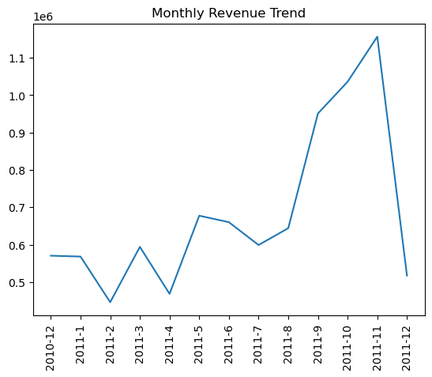

# Online Retail Data Analysis

## Why This Project Matters
Understanding customer behavior and sales performance is critical for any retail business.  
This project demonstrates how raw transactional data can be transformed into actionable insights using Python.

## Project Overview

This project explores transactional data from an online retail store to uncover insights into customer behavior, product performance, and sales trends.

Using Python, the analysis covers:

- Data cleaning and preprocessing
- Exploratory Data Analysis (EDA)
- Revenue and product insights
- Time-based sales trends
- Customer segmentation using RFM (Recency, Frequency, Monetary)

---

## Objectives

- Identify top-performing products and countries
- Analyze revenue trends over time
- Understand customer purchasing behavior
- Segment customers based on value and engagement

---

## Dataset Description

The dataset contains transactional records of an online retail store, including:

- InvoiceNo -> Unique transaction ID
- StockCode -> Product code
- Description -> Product name
- Quantity -> Number of items purchased
- InvoiceDate -> Date of transaction
- UnitPrice -> Price per unit
- CustomerID -> Unique customer identifier
- Country -> Customer location

---

## Data Cleaning Process

The dataset required several preprocessing steps:

- Removed rows with missing CustomerID
```python
df[df['CustomerID'].isnull()].head()
df = df.dropna(subset=['CustomerID'])  # removed rows with missing CustomerID
```

- Filtered out negative quantities (returns/cancellations)
```python
df = df[(df['Quantity'] > 0) & (df['UnitPrice'] > 0)] # Filter out rows with non-positive Quantity and UnitPrice
```

- Removed duplicate records
```python
df.duplicated().sum() # Check for duplicate rows
df = df.drop_duplicates() # Remove duplicate rows
df.duplicated().sum()
```

- Converted `InvoiceDate` to datetime format
```python
df['InvoiceDate'] = pd.to_datetime(df['InvoiceDate']) # Convert InvoiceDate to datetime format
```

- Created a new column:
  TotalPrice = Quantity × UnitPrice
```python
df['TotalPrice'] = df['Quantity'] * df['UnitPrice'] # Create a new column for total price
```
---

## Exploratory Data Analysis

### Top Products by Revenue
- Identified products generating the highest total revenue
- Helped highlight key revenue drivers
```python
top_products = df.groupby('Description')['TotalPrice'].sum().sort_values(ascending=False).head(10)
top_products.head(10)               # Display the top 10 products by total sales
```
```
Description
PAPER CRAFT , LITTLE BIRDIE           168469.60
REGENCY CAKESTAND 3 TIER              142264.75
WHITE HANGING HEART T-LIGHT HOLDER    100392.10
JUMBO BAG RED RETROSPOT                85040.54
MEDIUM CERAMIC TOP STORAGE JAR         81416.73
POSTAGE                                77803.96
PARTY BUNTING                          68785.23
ASSORTED COLOUR BIRD ORNAMENT          56413.03
Manual                                 53419.93
RABBIT NIGHT LIGHT                     51251.24
Name: TotalPrice, dtype: float64
```
```
top_quantity = df.groupby('Description')['Quantity'].sum().sort_values(ascending=False).head(10)
top_quantity.head(10)               # Display the top 10 products by quantity sold
```
```
Description
PAPER CRAFT , LITTLE BIRDIE           80995
MEDIUM CERAMIC TOP STORAGE JAR        77916
WORLD WAR 2 GLIDERS ASSTD DESIGNS     54319
JUMBO BAG RED RETROSPOT               46078
WHITE HANGING HEART T-LIGHT HOLDER    36706
ASSORTED COLOUR BIRD ORNAMENT         35263
PACK OF 72 RETROSPOT CAKE CASES       33670
POPCORN HOLDER                        30919
RABBIT NIGHT LIGHT                    27153
MINI PAINT SET VINTAGE                26076
Name: Quantity, dtype: int64
```

### Revenue by Country

- Analyzed geographic distribution of sales
- Identified top-performing markets
```
country_revenue = df.groupby('Country')['TotalPrice'].sum().sort_values(ascending=False)
country_revenue.head(10)             # Display the top 10 countries by total revenue
```

---

## Time Series Analysis

### Monthly Revenue Trend

- Extracted year and month from transaction dates
```
df['Year'] = df['InvoiceDate'].dt.year
df['Month'] = df['InvoiceDate'].dt.month # Extract year and month from InvoiceDate for time-based analysis
```

- Observed how revenue changes over time
```
monthly_revenue = df.groupby(['Year', 'Month'])['TotalPrice'].sum().reset_index()
monthly_revenue.head() # Display the monthly revenue to analyze trends over time
```
```
Year	Month	TotalPrice
0	2010	12	570422.730
1	2011	1	568101.310
2	2011	2	446084.920
3	2011	3	594081.760
4	2011	4	468374.331
```

- Identified fluctuations and seasonal patterns
```
monthly_revenue['YearMonth'] = monthly_revenue['Year'].astype(str) + '-' + monthly_revenue['Month'].astype(str)
monthly_revenue.head() # Create a YearMonth column for easier plotting of monthly revenue trends
```
```
Year	Month	TotalPrice	YearMonth
0	2010	12	570422.730	2010-12
1	2011	1	568101.310	2011-1
2	2011	2	446084.920	2011-2
3	2011	3	594081.760	2011-3
4	2011	4	468374.331	2011-4
```
```

```

---

## Customer Analysis (RFM)

Customers were analyzed using three key metrics:

- Recency (R):
  How recently a customer made a purchase

- Frequency (F):
  How often a customer makes purchases

- Monetary (M):
  Total amount spent by the customer

### RFM Segmentation

Customers were grouped into segments such as:

- Best Customers
- Loyal Customers
- Recent Customers
- Others

This helps identify:

- High-value customers
- At-risk customers
- Engagement patterns

---

## Visualizations

The project includes both static and interactive visualizations using:

- Matplotlib
- Plotly (for interactive charts)

Examples:

- Top products bar charts
- Country revenue charts
- Monthly revenue trends
- Customer segment distributions

---

## Key Insights

- A small number of products generate a large portion of revenue
- Revenue shows fluctuations over time (possible seasonality)
- Most customers purchase infrequently
- A small group of customers contributes the majority of revenue
- High-value customers can be targeted for retention strategies

---

## Conclusion

This analysis demonstrates how transactional data can be transformed into actionable business insights.

---

## Tools & Technologies

* Python
* Pandas
* Matplotlib
* Plotly
* Jupyter Notebook (VS Code)

---

## Project Structure

```
├── Online_Retail.ipynb
├── Online_Retail.csv
└── README.md
```
---

## Acknowledgment

This project is part of a data analysis learning journey focused on building real-world analytical skills.
